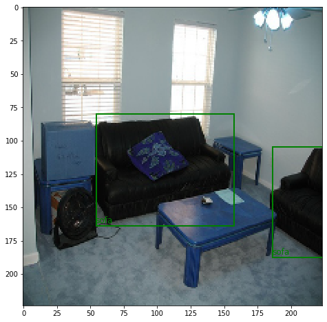
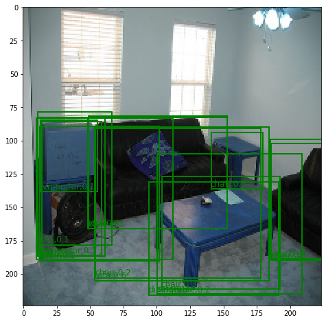
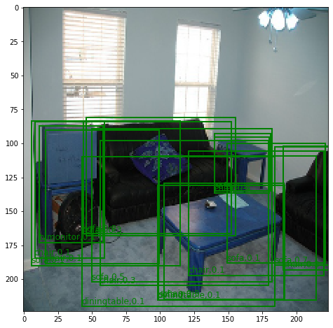

# Accurate Prediction of Bounding Boxes in Object Detection

## Introduction
This repository contains experiments to reproduce the results of the paper [Bounding Box Regression with Uncertainty for Accurate Object Detection (He et al.)](https://openaccess.thecvf.com/content_CVPR_2019/papers/He_Bounding_Box_Regression_With_Uncertainty_for_Accurate_Object_Detection_CVPR_2019_paper.pdf). For more details, check out this [report](report.pdf) / [slides](slides.pptx) / [presentation](https://youtu.be/2Mfxi8NbSPo).

</img> </img> 

## Running Experiments
- Run the notebook file `kl_loss_MMDet.ipynb` with CPU configuration and follow the instructions in the file.  

- Run the notebook file `kl_loss_pytorch.ipynb` and follow the instructions in the file. Note that Google Drive has been linked to the notebook for data and output storage. 

## Visualization

See a visualization of the objects getting detected using this [app](https://souradipp76-object-detection-kl-app-app-v5thmx.streamlit.app/).

## Contributing

Pull requests are welcome. For major changes, please open an issue first to discuss what you would like to change.

## License

[MIT](https://choosealicense.com/licenses/mit/)